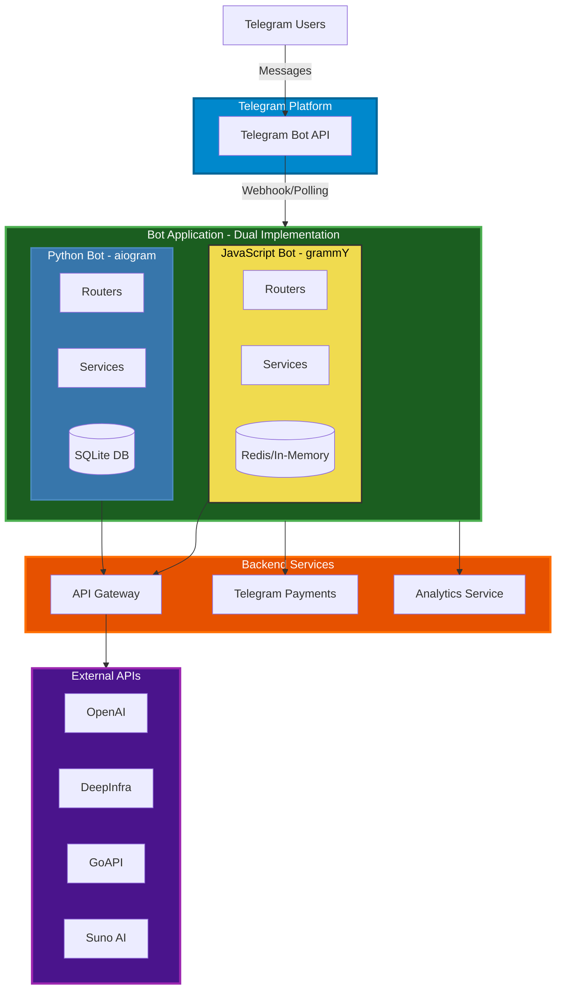
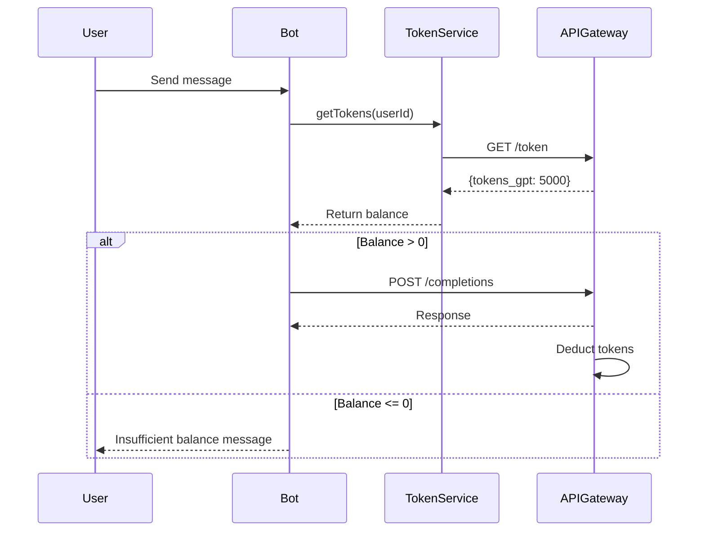
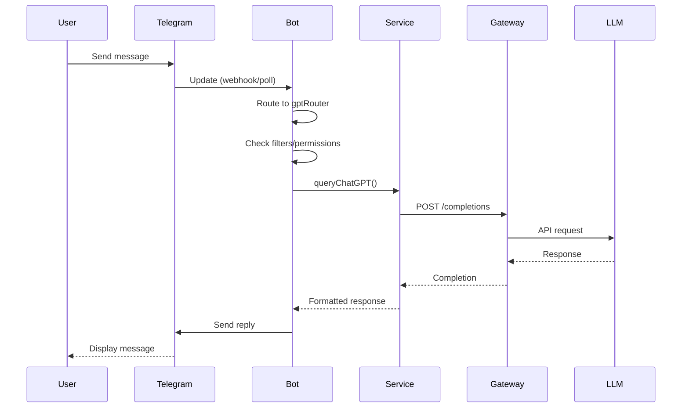
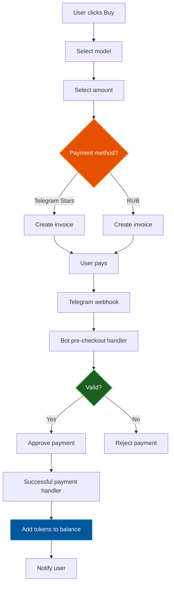

# Telegram Bot Architecture

## Overview

The Telegram Bot is a multi-language (Python/JavaScript) chatbot application that provides AI-powered conversational capabilities through Telegram. It acts as a frontend client for the API Gateway, offering users access to multiple LLM models, image generation, voice transcription, payment processing, and referral systems.

**Version**: 1.0.0
**License**: Unlicense (public domain)
**Runtime**: Python 3.10+ / Bun.js (JavaScript)
**Frameworks**: aiogram (Python) / grammY (JavaScript)

---

## System Architecture

### High-Level Architecture



---

## Directory Structure

### Root Structure

```
telegram-bot/
├── Python Implementation (Root Level)
│   ├── bot/                     # Bot modules
│   ├── services/                # Business logic
│   ├── db/                      # Database initialization
│   ├── __main__.py             # Python entry point
│   ├── config.py               # Configuration
│   ├── requirements.txt        # Python dependencies
│   └── data_base.db           # SQLite database
│
├── JavaScript Implementation
│   └── js/
│       ├── src/
│       │   ├── bot/            # Bot modules
│       │   ├── services/       # Business logic
│       │   ├── db/             # Database layer
│       │   ├── locales/        # i18n translations
│       │   ├── utils/          # Utilities
│       │   ├── index.js        # JS entry point
│       │   ├── __main__.js     # Bun entry point
│       │   ├── config.js       # Configuration
│       │   └── i18n.js         # Internationalization
│       ├── tests/              # Test suite
│       ├── package.json        # JS dependencies
│       └── bun.lock           # Bun lockfile
│
├── Shared Resources
│   ├── attachments/            # Static files
│   ├── .gitpod.yml            # Gitpod config
│   ├── docker-compose.yml     # Docker orchestration
│   ├── Dockerfile             # Container definition
│   ├── LICENSE                # Unlicense
│   ├── readme.md              # Documentation
│   └── docs.md                # Additional docs
```

### Python Bot Structure

```
bot/
├── __init__.py
├── bot_run.py                  # Main bot setup
├── commands.py                 # Command definitions
├── constants.py                # Constants
├── filters.py                  # Message filters
├── main_keyboard.py            # Keyboard layouts
├── utils.py                    # Bot utilities
├── empty_prompt.py             # Empty prompt handler
├── middlewares/
│   └── MiddlewareAward.py      # Reward middleware
├── gpt/                        # GPT chat module
│   ├── __init__.py
│   ├── router.py               # GPT routes
│   ├── db_system_message.py    # System messages DB
│   ├── system_messages.py      # System message templates
│   └── utils.py                # GPT utilities
├── images/                     # Image generation
│   ├── __init__.py
│   └── router.py
├── image_editing/              # Image editing
│   ├── __init__.py
│   └── router.py
├── payment/                    # Payment processing
│   ├── __init__.py
│   ├── router.py
│   └── products.py             # Product definitions
├── referral/                   # Referral system
│   ├── __init__.py
│   └── router.py
├── agreement/                  # User agreements
│   ├── __init__.py
│   └── router.py
├── start/                      # Start command
│   ├── __init__.py
│   └── router.py
├── tasks/                      # Task management
│   ├── __init__.py
│   └── router.py
├── suno/                       # Suno AI integration
│   ├── __init__.py
│   └── router.py
├── diagnostics/                # Diagnostics
│   ├── __init__.py
│   └── router.py
└── api/                        # API endpoints
    ├── __init__.py
    └── router.py
```

### JavaScript Bot Structure

```
js/src/
├── index.js                    # Main entry
├── __main__.js                 # Bun runner
├── config.js                   # Configuration
├── i18n.js                     # i18n setup
├── bot/
│   ├── index.js                # Bot initialization
│   ├── constants.js            # Constants
│   ├── commands.js             # Command definitions
│   ├── filters.js              # Message filters
│   ├── utils.js                # Bot utilities
│   ├── main_keyboard.js        # Keyboard layouts
│   ├── empty_prompt.js         # Empty prompt handler
│   ├── gpt/                    # GPT module
│   │   ├── index.js
│   │   ├── router.js
│   │   ├── db_system_message.js
│   │   ├── system_messages.js
│   │   └── utils.js
│   ├── start/
│   │   ├── index.js
│   │   └── router.js
│   ├── balance/
│   │   └── router.js
│   ├── payment/
│   │   ├── index.js
│   │   ├── router.js
│   │   └── products.js
│   └── [other modules...]
├── services/
│   ├── index.js
│   ├── gpt_service.js          # GPT model management
│   ├── completions_service.js  # API completions
│   ├── tokenize_service.js     # Token management
│   ├── image_service.js        # Image generation
│   ├── image_editing.js        # Image editing
│   ├── image_utils.js          # Image utilities
│   ├── suno_service.js         # Suno AI
│   ├── referrals_service.js    # Referral logic
│   ├── agreement_service.js    # Agreement handling
│   ├── state_service.js        # User state management
│   ├── system_message_service.js
│   ├── openai_stub.js          # OpenAI stub
│   └── utils.js                # Service utilities
├── db/
│   ├── index.js
│   └── init_db.js              # Redis/In-memory DB
├── utils/
│   └── logger.js               # Pino logger
└── locales/
    ├── en.yml                  # English translations
    └── ru.yml                  # Russian translations
```

---

## Core Components

### 1. Bot Initialization

#### Python Bot (`bot/bot_run.py`)

**Framework**: aiogram 3.6.0

**Key Features**:
- Webhook and polling support
- Album/media group middleware
- SQLite database with vedis for key-value storage
- Analytics integration

**Initialization Flow**:
```python
dp = Dispatcher()
dp.include_router(start_router)
dp.include_router(gpt_router)
dp.include_router(payment_router)
# ... other routers

if WEBHOOK_ENABLED:
    await bot.set_webhook(WEBHOOK_URL)
else:
    await bot.delete_webhook()
    await dp.start_polling(bot)
```

#### JavaScript Bot (`js/src/index.js`)

**Framework**: grammY 1.37.0

**Key Features**:
- Webhook support with Bun.serve
- Long polling with @grammyjs/runner
- Redis or in-memory storage
- @grammyjs/i18n for internationalization

**Initialization Flow**:
```javascript
const bot = new Bot(config.botToken);
bot.use(i18n);
bot.use(albumMiddleware());
applyRouters(bot);

if (webhookEnabled) {
    await bot.api.setWebhook(webhookUrl);
    Bun.serve({ /* webhook server */ });
} else {
    run(bot);
}
```

---

### 2. Router Architecture

Both implementations use a modular router-based architecture:

#### Common Routers

- **start** - Welcome message, onboarding
- **gpt** - Chat with AI models
- **payment** - Balance purchase, donations
- **balance** - Check token balance
- **images** - Image generation
- **image_editing** - Edit images
- **referral** - Referral system
- **agreement** - Terms acceptance
- **suno** - Music generation
- **tasks** - Task management
- **diagnostics** - System diagnostics
- **api** - API access

Each router handles:
1. Command/callback filtering
2. Permission checking
3. Business logic delegation to services
4. Response formatting

---

### 3. Services Layer

#### GPT Service

**Responsibilities**:
- Model selection and persistence
- System message management
- Request state tracking

**Supported Models**:
- **OpenAI**: GPT-3.5, GPT-4o, GPT-4o-mini, o1-mini, o1-preview, o3-mini
- **Anthropic**: Claude 3 Opus, Claude 3.5 Sonnet, Claude 3.5 Haiku, Claude 3.7 Sonnet
- **Meta**: Llama 3.1 (8B, 70B, 405B), Llama 3 (70B)
- **DeepSeek**: DeepSeek Chat, DeepSeek Reasoner
- **Other**: Uncensored, GPT-Auto, GPT-4o-Unofficial

**Model Mapping**:
```javascript
{
  [GPTModels.GPT_4o]: 'gpt-4o',
  [GPTModels.Claude_3_Opus]: 'claude-3-opus',
  [GPTModels.O1_mini]: 'o1-mini',
  // ...
}
```

#### Completions Service

**Responsibilities**:
- API Gateway communication
- Conversation history management
- Multimodal conversation support (GoAPI)
- Error handling and retries

**API Integration**:
```javascript
async queryChatGPT(userId, message, systemMessage, gptModel) {
    const payload = {
        userId: getUserName(userId),
        content: message,
        systemMessage,
        model: gptModel
    };
    const response = await asyncPost(
        `${config.proxyUrl}/completions`,
        { params: { masterToken: config.adminToken }, json: payload }
    );
    return response.json();
}
```

#### Token Service

**Responsibilities**:
- User token balance tracking
- API Gateway token synchronization
- Balance checks before requests

**Token Flow**:


#### Image Services

**Image Generation**:
- DALL-E integration via API Gateway
- Prompt enhancement
- Multi-image support

**Image Editing**:
- Inpainting
- Variations
- Style transfer

#### Suno Service

**Responsibilities**:
- Music generation requests
- Track status polling
- Audio file delivery

#### Referral Service

**Responsibilities**:
- Referral link generation
- Referral tracking
- Bonus distribution

---

### 4. Data Layer

#### Python: SQLite + Vedis

**SQLite Schema**:
```sql
CREATE TABLE users (
    user_id INTEGER PRIMARY KEY,
    username TEXT,
    created_at TIMESTAMP
);

CREATE TABLE dialogs (
    id INTEGER PRIMARY KEY,
    user_id INTEGER,
    content TEXT,
    role TEXT,
    created_at TIMESTAMP
);
```

**Vedis KV Store**:
```python
db = Vedis('data_base.db')
db[f'{user_id}_current_model'] = 'gpt-4o'
db[f'{user_id}_system_message'] = 'default'
```

#### JavaScript: Redis / In-Memory

**Redis Connection**:
```javascript
let redisClient = null;
if (process.env.REDIS_URL) {
    redisClient = new Redis(process.env.REDIS_URL);
}
```

**Fallback In-Memory**:
```javascript
const kv = new Map();

dataBase.get = async (key) => {
    if (redisReady()) return await redisClient.getBuffer(key);
    return kv.get(key);
};
```

**Key Format**:
```
{userId}_current_model
{userId}_current_system_message
{userId}_state
{userId}_tokens
```

---

### 5. Middleware System

#### Python Middleware

**Award Middleware** (`MiddlewareAward.py`):
- Daily login rewards
- First-time bonuses
- Activity tracking

#### JavaScript Middleware

**Album Middleware**:
- Groups media into albums
- Batch message processing
- Timeout-based batching

```javascript
function albumMiddleware() {
    const albumData = new Map();
    return async (ctx, next) => {
        if (ctx.message.media_group_id) {
            // Collect messages in album
            const groupId = ctx.message.media_group_id;
            albumData.get(groupId).push(ctx.message);
            await new Promise(r => setTimeout(r, 10));
            // Process once for entire album
            if (isLastMessage) {
                ctx.album = albumData.get(groupId);
                await next();
            }
        }
    };
}
```

---

## Message Flow

### Text Message Processing



### Payment Flow



---

## Configuration

### Environment Variables

**Required**:
- `TOKEN` - Telegram Bot token from @BotFather
- `ADMIN_TOKEN` - API Gateway admin token
- `PROXY_URL` - API Gateway base URL (default: https://api.deep.assistant.run.place)

**Optional**:
- `ANALYTICS_URL` - Analytics endpoint
- `KEY_DEEPINFRA` - DeepInfra API key
- `GO_API_KEY` - GoAPI key for multimodal
- `GUO_GUO_KEY` - Alternative API provider
- `PAYMENTS_TOKEN` - Telegram Payments token
- `REDIS_URL` - Redis connection string (JS only)

**Webhook Configuration**:
- `WEBHOOK_ENABLED` - true/false
- `WEBHOOK_URL` - Public webhook URL
- `WEBHOOK_PATH` - Webhook endpoint path (default: /webhook)
- `WEBHOOK_HOST` - Bind address (default: 0.0.0.0)
- `WEBHOOK_PORT` - Listen port (default: 3000)

**Development**:
- `IS_DEV` - Enable development mode
- `STOP_ENABLED` - Enable /stop command

**Telegram Client** (JS only):
- `TELEGRAM_API_ID` - Telegram API ID
- `TELEGRAM_API_HASH` - Telegram API hash
- `TELEGRAM_PHONE` - Phone number for client
- `TELEGRAM_BOT_NAME` - Bot username

---

## Deployment

### Docker

**Dockerfile** (Python):
```dockerfile
FROM python:3.10-slim
WORKDIR /app
COPY requirements.txt .
RUN pip install -r requirements.txt
COPY . .
CMD ["python", "__main__.py"]
```

**Dockerfile** (JavaScript):
```dockerfile
FROM oven/bun:latest
WORKDIR /app
COPY js/package.json js/bun.lock ./
RUN bun install
COPY js/ .
CMD ["bun", "src/__main__.js"]
```

### Docker Compose

```yaml
version: '3.8'
services:
  telegram-bot:
    build: .
    environment:
      - TOKEN=${TOKEN}
      - ADMIN_TOKEN=${ADMIN_TOKEN}
      - PROXY_URL=${PROXY_URL}
      - REDIS_URL=redis://redis:6379
    depends_on:
      - redis
    restart: unless-stopped

  redis:
    image: redis:alpine
    volumes:
      - redis_data:/data
    restart: unless-stopped

volumes:
  redis_data:
```

---

## Commands

### User Commands

- `/start` - Welcome message, onboarding
- `/gpt` - Open AI chat
- `/balance` - Check token balance
- `/buy` - Purchase tokens
- `/clear` - Clear conversation history
- `/model` - Change AI model
- `/system` - Change system message
- `/referral` - Get referral link
- `/history` - Get conversation history
- `/help` - Show help
- `/donate` - Support the project

### Admin Commands (if enabled)

- `/stop` - Shutdown bot
- `/stats` - Usage statistics

---

## Internationalization

### Supported Languages

- **English** (`en`)
- **Russian** (`ru`)

### i18n Implementation

**JavaScript** (@grammyjs/i18n):
```javascript
import { I18n } from '@grammyjs/i18n';

const i18n = new I18n({
    defaultLocale: 'ru',
    directory: 'src/locales'
});

// Usage in handlers
ctx.reply(ctx.t('welcome'));
```

**Locale Files** (`locales/ru.yml`):
```yaml
welcome: "Добро пожаловать!"
balance:
  title: "Ваш баланс"
  tokens: "Токены: {tokens}⚡️"
payment:
  title: "Пополнение баланса"
  gpt_4o: "GPT-4o"
  gpt_3_5: "GPT-3.5"
```

---

## Error Handling

### Bot-Level Error Handling

**Python**:
```python
@dp.errors()
async def error_handler(event: ErrorEvent):
    logging.exception(f"Update: {event.update} caused error: {event.exception}")
    if IS_DEV:
        raise event.exception
```

**JavaScript**:
```javascript
bot.catch((err) => {
    log.error('Bot error:', () => err);
    if (config.isDev) {
        process.exit(1);
    }
});
```

### Graceful Shutdown

**JavaScript**:
```javascript
async function gracefulShutdown() {
    if (currentRunner) await currentRunner.stop();
    if (currentBot) await currentBot.api.deleteWebhook();
    process.exit(0);
}

process.on('SIGINT', gracefulShutdown);
process.on('SIGTERM', gracefulShutdown);
```

---

## Dependencies

### Python (`requirements.txt`)

```
aiogram~=3.6.0          # Telegram bot framework
tiktoken==0.7.0         # Token counting
vedis==0.7.2            # Key-value database
aiofiles==23.2.1        # Async file operations
schedule==1.2.2         # Task scheduling
openai==1.34.0          # OpenAI SDK
httpx==0.24.1           # HTTP client
requests~=2.31.0        # HTTP requests
telegramify_markdown==0.1.12  # Markdown formatting
pydub~=0.25.1           # Audio processing
```

### JavaScript (`package.json`)

```json
{
  "dependencies": {
    "grammy": "^1.37.0",              // Telegram bot framework
    "@grammyjs/i18n": "^1.1.2",       // Internationalization
    "@grammyjs/runner": "^2.0.3",     // Polling runner
    "@dotenvx/dotenvx": "^1.48.4",    // Environment variables
    "ioredis": "^5.6.1",              // Redis client
    "openai": "^5.8.2",               // OpenAI SDK
    "pino": "^9.7.0",                 // Logger
    "pino-pretty": "^13.0.0",         // Pretty logs
    "telegram": "^2.26.22",           // MTProto client
    "telegramify-markdown": "^1.3.0", // Markdown formatting
    "uuid": "^11.1.0",                // UUID generation
    "yaml": "^2.8.0"                  // YAML parser
  }
}
```

---

## Testing

### JavaScript Tests

**Location**: `js/tests/`

**Test Files**:
- `test.js` - Main test suite
- `setup-envs.js` - Environment setup
- `setup-session.js` - Session initialization
- `user-bot.js` - User bot simulation
- `start.test.mjs` - Start command tests

**Running Tests**:
```bash
cd js
bun test
```

---

## Logging

### Python Logging

Standard Python logging module:
```python
import logging
logging.basicConfig(level=logging.INFO)
logger = logging.getLogger(__name__)
```

### JavaScript Logging

**Pino** with pretty printing:
```javascript
import pino from 'pino';

const logger = pino({
    transport: {
        target: 'pino-pretty',
        options: {
            colorize: true,
            translateTime: 'SYS:standard'
        }
    }
});
```

**Log Files**: `js/logs/bot.log`

---

## Performance Characteristics

### Concurrency

- **Python**: Async/await with aiogram (asyncio-based)
- **JavaScript**: Bun runtime with native async
- **Webhook**: Handles concurrent requests
- **Polling**: Sequential update processing

### Resource Usage

- **Memory**: ~50-100MB (Python), ~30-60MB (JS)
- **Database**: SQLite (Python), Redis/In-memory (JS)
- **API Rate Limits**: Managed by API Gateway

### Optimization Opportunities

1. **Data Storage**: Migrate to [links-notation](https://github.com/link-foundation/links-notation) for human-readable persistence, then to [Doublets](https://github.com/linksplatform/Data.Doublets) for high-performance associative storage (> 10k users)
2. **Message Queuing**: Bull/BullMQ for background tasks
3. **Load Balancing**: Multiple bot instances with same token
4. **Associative Knowledge Network**: Store conversation history as associative links in Doublets for efficient Associative Knowledge Network representation
5. **CDN**: Cache static attachments

---

## Security Considerations

### Token Security

- Tokens stored in environment variables
- Never logged or exposed in errors
- Admin token required for API Gateway

### User Privacy

- User data stored locally
- Conversation history in database
- GDPR compliance considerations

### Payment Security

- Telegram Payments integration (PCI compliant)
- Pre-checkout validation
- No card data stored

### Rate Limiting

- Per-user request tracking
- Balance-based throttling
- Conversation state locking

---

## Known Issues & TODOs

### Active Issues

1. **Python**: Vedis database may have concurrency issues
2. **JavaScript**: In-memory storage lost on restart
3. **Multimodal**: GoAPI conversation slot management needs improvement
4. **Error Messages**: Mix of Russian and English

### Recommended Improvements

1. **Database Migration**: Migrate from SQLite/Vedis/Redis to [links-notation](https://github.com/link-foundation/links-notation) (file-based human-readable) and then to [Doublets](https://github.com/linksplatform/Data.Doublets) (binary associative data store) for all stored data
2. Add comprehensive test coverage
3. Standardize error messages (choose single language or proper i18n)
4. Add request tracing/correlation IDs
5. Implement circuit breakers for external APIs
6. Add health check endpoints
7. Improve logging structure
8. Add metrics/monitoring (Prometheus)
9. Document API contract with API Gateway
10. Migrate conversation history to Doublets for efficient Associative Knowledge Network storage

---

## Troubleshooting

### Common Issues

**1. "Insufficient balance" message**
- Check token balance: `/balance`
- Purchase tokens: `/buy`
- Check API Gateway token sync

**2. Bot not responding**
- Verify webhook URL is accessible (if webhook mode)
- Check bot token validity
- Review logs for errors
- Verify API Gateway is running

**3. Payment not working**
- Verify `PAYMENTS_TOKEN` is set
- Check Telegram Payments configuration
- Review pre-checkout handler logs

**4. Redis connection failed (JS)**
- Check `REDIS_URL` environment variable
- Falls back to in-memory (data lost on restart)
- Verify Redis server is running

**5. Database locked (Python)**
- SQLite doesn't handle high concurrency well
- Consider migrating to PostgreSQL
- Check for long-running transactions

---

## API Integration

### API Gateway Endpoints Used

**Completions**:
```
POST /completions
Query: ?masterToken=...
Body: {userId, content, systemMessage, model}
```

**Token Management**:
```
GET /token?masterToken=...&userId=...
PUT /token?masterToken=...&userId=...
Body: {operation: "add"/"subtract", amount}
```

**Dialog Management**:
```
DELETE /dialog?masterToken=...&userId=...
GET /dialog?masterToken=...&userId=...
```

**Referrals**:
```
POST /referral?masterToken=...
Body: {referrerId, referredId}
GET /referral?masterToken=...&userId=...
```

---

## Development

### Running Locally

**Python**:
```bash
pip install -r requirements.txt
cp config.example.py config.py
# Edit config.py with your tokens
python __main__.py
```

**JavaScript**:
```bash
cd js
bun install
# Set environment variables
bun src/__main__.js
```

### Environment Setup

**Python**:
```bash
python -m venv venv
source venv/bin/activate  # Linux/Mac
venv\Scripts\activate     # Windows
pip install -r requirements.txt
```

**JavaScript**:
```bash
# Install Bun
curl -fsSL https://bun.sh/install | bash

# Or use Node.js
npm install
```

### Adding a New Router

1. Create router module:
```javascript
// js/src/bot/feature/router.js
import { Composer } from 'grammy';
export const featureRouter = new Composer();

featureRouter.command('feature', async (ctx) => {
    await ctx.reply('Feature response');
});
```

2. Register in `index.js`:
```javascript
import { featureRouter } from './bot/feature/router.js';
bot.use(featureRouter);
```

---

## License

This software is released into the **public domain** under the [Unlicense](https://unlicense.org).

**Important**: The Unlicense is NOT the same as having no license or being "unlicensed". The Unlicense is a specific public domain dedication that explicitly grants everyone the freedom to use, modify, and distribute this software without restrictions.

Anyone is free to copy, modify, publish, use, compile, sell, or distribute this software, either in source code form or as a compiled binary, for any purpose, commercial or non-commercial, and by any means.

For the full license text, see the [LICENSE](LICENSE) file or visit [unlicense.org](https://unlicense.org).

---

## Contributors

Deep.Assistant Team

---

## Glossary

- **aiogram**: Async Telegram Bot framework for Python
- **grammY**: Telegram Bot framework for JavaScript/TypeScript
- **Bun**: Fast all-in-one JavaScript runtime
- **Vedis**: Embedded key-value database (Python)
- **Redis**: In-memory data structure store
- **Router**: Module handling specific bot commands/features
- **Middleware**: Function that processes updates before routers
- **Handler**: Function that responds to specific update types
- **Callback Query**: Inline keyboard button press
- **Album**: Group of media files sent together
- **System Message**: Instruction defining AI assistant behavior
- **Token Balance**: User's available API usage credits

---

*Document generated: 2025-10-25*
*Version: 1.0.0*
